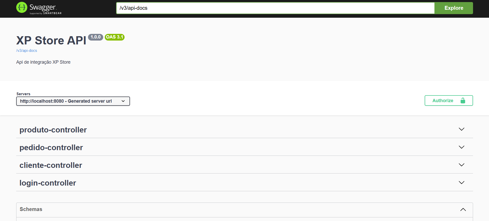

<div align="center">


</div>
<br>


## Tabela de conteúdo

* [Técnicas e tecnologias utilizadas](#técnicas-e-tecnologias-utilizadas)
* [Diagrama UML](#diagrama-uml)
* [Estrutura de arquivos](#estrutura-de-arquivos)
* [Abrir e rodar](#abrir-e-rodar)
* [Licença](#licença)

## Técnicas e tecnologias utilizadas

- **Spring Boot**: Framework para construção de APIs REST com inicialização rápida e configuração mínima.
- **Arquitetura MVC (Model-View-Controller)**: Organização em camadas separando responsabilidades entre controle, serviço e persistência.
- **RESTful API**: Implementação de endpoints com verbos HTTP (GET, POST, PUT, DELETE) e estrutura semântica.
- **Bean Validation**: Validações com anotações como `@NotBlank`, `@Email`, `@Size`, entre outras.
- **Swagger (OpenAPI)**: Documentação interativa da API acessível via navegador.
- **PostgreSQL**: Banco de dados relacional usado para persistência da aplicação.
- **DTOs e ModelMapper**: Conversão eficiente entre objetos de entidade e objetos de transporte.
- **Tratamento global de exceções**: Por meio de um handler centralizado, melhora a resposta em caso de erros.

### Bibliotecas

**Essenciais Core:**

- [Spring Boot Starter Web](https://docs.spring.io/spring-boot/docs/current/reference/htmlsingle/#web) - Criação de APIs RESTful.
- [Spring Boot Starter Data JPA](https://spring.io/projects/spring-data-jpa) - Acesso a dados com JPA.
- [PostgreSQL Driver](https://mvnrepository.com/artifact/org.postgresql/postgresql) - Driver para conexão com banco PostgreSQL.
- [H2 Database Driver](https://mvnrepository.com/artifact/com.h2database/h2) - Driver para conexão com banco H2 (banco de dados em memória ou arquivo).
- [ModelMapper](http://modelmapper.org/) - Conversão entre entidades e DTOs.
- [Springdoc OpenAPI](https://springdoc.org/) - Geração de documentação Swagger.
- [Lombok](https://projectlombok.org/) - Redução de código repetitivo (getters/setters, construtores).

## Diagrama UML
<div align="center">

</div>

## Estrutura de arquivos

O acesso ao projeto está separado da seguinte forma:

Foi utilizada a arquitetura **MVC** para manter uma separação clara entre responsabilidades e facilitar a manutenção e escalabilidade do sistema.
```
src
└── main
└── java
└── com.xp.store
├── config.swagger
│   └── SwaggerConfig
├── controllers
│   ├── ClienteController
│   ├── LoginController
│   ├── PedidoController
│   └── ProdutoController
├── dto
├── model
│   ├── Cliente
│   ├── Pedido
│   └── Produto
├── repository
│   ├── ClienteRepository
│   ├── PedidoRepository
│   └── ProdutoRepository
├── security
│   └── jwt
│       ├── JwtAuthenticationEntryPoint
│       ├── SecurityConfig
│       └── SecurityUtils
├── service
│   ├── ClienteService
│   ├── PedidoService
│   └── ProdutoService
└── utils
└── StoreApplication
```

## Abrir e rodar

**Para executar este projeto você precisa:**

- Ter o [Java 21](https://www.azul.com/downloads/?package=jdk#zulu) instalado;
- Ter o [Maven](https://maven.apache.org/install.html) configurado;
- Ter o [PostgreSQL](https://www.postgresql.org/download/) com banco de dados criado chamado `xp_store`;
- Ter uma IDE como o [IntelliJ IDEA](https://www.jetbrains.com/idea/) ou [VS Code](https://code.visualstudio.com/).

**Passos para rodar:**

1. Clone o repositório:
   ```bash
   git clone https://github.com/gabrielmenoi0/xp-store.git
   cd xp-store-api  
   spring:
      datasource:
       url: jdbc:postgresql://localhost:5432/xp_store
       username: postgres
       password: 147914
       driver-class-name: org.postgresql.Driver

Execute o projeto
<br>
`./mvnw spring-boot:run`
    

Acesse o Swagger para testar a API:
<br>
`http://localhost:8080/swagger-ui.html`

## Licença
Este projeto foi desenvolvido como parte do curso de Pós-Graduação em Arquitetura de Software e tem finalidade exclusivamente educacional.

